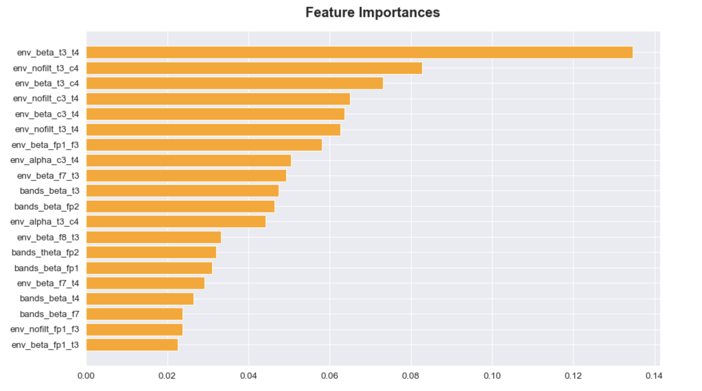
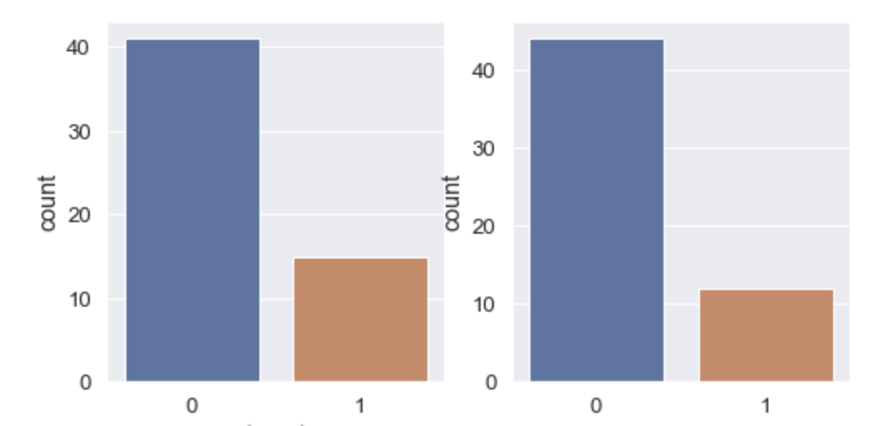
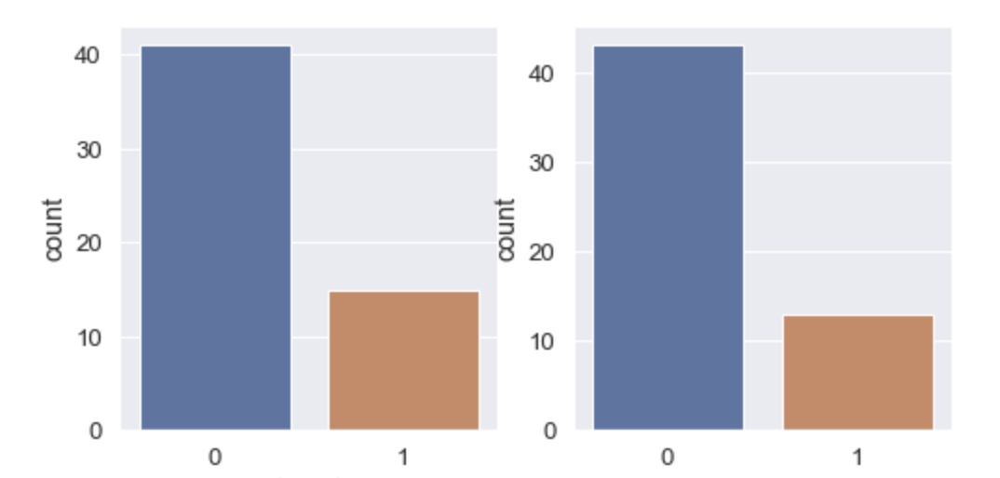

# EEG Analysis for Brain trauma detection

### Introduction

Traumatic Brain Injury (TBI) is a leading cause of death and disability around the globe and presents a major worldwide social, economic, and health problem. It is the number one cause of coma, it plays the leading role in disability due to trauma, and is the leading cause of brain damage in children and young adults. Early diagnosis and treatment improves the chances of recovering from this type of injury, which otherwise could affect thought processes, ability to learn, speech, emotions, temper control, stress level, memory, problem-solving abilities, behavior, and sensory perceptions.

### Outline of the project

1. Preprocessing
    * Artifacts detection
2. Feature engineering
    * Power spectral density. regions (Left frontal, right frontal, parietal..)
    * Envelope of signal, bands: all, alpha, beta
    * Coherence (mne function)
3. Feature analysis - EDA
    * KDE, boxplots and swarm plots of features
    * Random features comparison
    * Feature importance
4. Model training
    * Cross-validation
    * Random forest
    * Logistic regression

5. Testing

### Main task:

Work on the feature analysis, feature selection and development of Machine Learning approach for brain trauma detection.

Fig 1. Selected features.

### Expected results:

As the final result, Machine learning model able to distinguish people who suffered brain trauma in past from healthy controls group.

Fig 2. Random Forest performance 0(healthy) and 1(trauma): left true values, right predicted.

Fig 3. Logistic Regression performance 0(healthy) and 1(trauma): left true values, right predicted.

### Reproducibility

Main: `BrainTraumaDetection.ipynb`, contain all steps described in this project
* `Artifacts.ipynb`, dedicated to detection of artifacts
* `FeatureAnalysis.ipynb`, analysis of features generated

### Adviser:

Vasily Klucharev, Director of Institute for Cognitive Neuroscience - HSE
Egor Levchenko, HSE
________________________________________________

### References:
* https://www.oatext.com/pdf/JSIN-7-230.pdf
* https://neuro.psychiatryonline.org/doi/full/10.1176/jnp.13.1.77
* https://mne.tools/dev/auto_tutorials/preprocessing/plot_10_preprocessing_overview.html