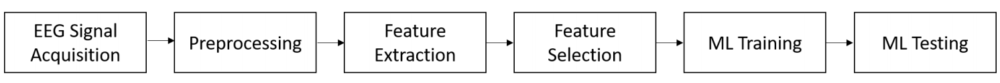

# EEG Analysis for Brain trauma detection

EEG analysis for brain traumatic injury detection 

# Outline of the project

1. Preprocessing.
    * Two strategies
2. Compute features.
    * Relative band power. Ratios. Average in regions (Left frontal, right frontal, parietal..)
    * (F3, F7, T3, C3);     (F4, F8, T4, C4);   (T5, P3, O1);  (T6, P4, O2);  (Fz, Cz, Pz)
    * Coherence (mne function)
3. Analyze features - EDA. Flexible.
    * Compute ROC-AUC single features, or z = (mean_1 - mean_2) / std or ..
    * Plot KDE or boxplots or swarm plots
    * Compare with random features
    * Perform stat tests (mann-whitney/t-test with FWE correction)
4. Build ML model with cross-validation
    * Cross-validation
    * Logistic regression or Linear SVM model
    
    
### Project team:

> Jaspers Huanay – Intermediate experience with ML 

### Introduction

Depression is a global public health problem, which has a relatively high lifetime prevalence, and is associated with significant morbidity. Currently, there are no clinically useful diagnostic biomarkers that are able to confirm a diagnosis of MDD from bipolar disorder (BD) in the early depressive episode1. Therefore, studies of methods that might improve the early detection and treatment of mild depression are both necessary and meaningful. Thus the aim of this project is to build a classifier and search the potential biomarkers of major depression.

### This project expects to generate a full EEG processing pipeline including:

- Raw data preprocessing
- Feature extraction
- Exploratory data analysis
- Statistical testing
- Performance of obtained features with Machine learning 

### Main task:

Work on the feature analysis and development of Machine Learning approach for brain trauma detection.

### Expected results:

As the final result, the ML pipeline able to explore significant predictors on the data and provide better-quality metrics for helping to distinguish people suffered from brain trauma in past from healthy controls.

### Adviser:

Alexander Ledovsky, Research Engineer of Skolkovo Institute of Science and Technology (Skoltech), Moscow.
________________________________________________

# Workflow:

1) Preprocessing EEG files:

**- Preprocessing.ipynb**

- Getting number and names of channels based on the international guideline:
prefrontal = fp1,fp2
frontal = f7,f3,f4,fz,f8
central/temporal = t3,c3,cz,c4,t4
parietal = t5,p3,pz,p4,t6
occipital = o1,o2

2) Feature Engineering:

**- FeaturesEngineering.ipynb**

- Ratios bands
- Coherence
- Conectivity
- Psi

3) Exploratory Data Analysis:

**- AnalyzeFeatures.ipynb**

- KDE
- Correlation

4) Exploratory Data Analysis:

**- AnalyzeFeatures.ipynb**

- KDE
- Correlation

5) ML models:

**- MLworkflow.ipynb**

# External link to CometML:

